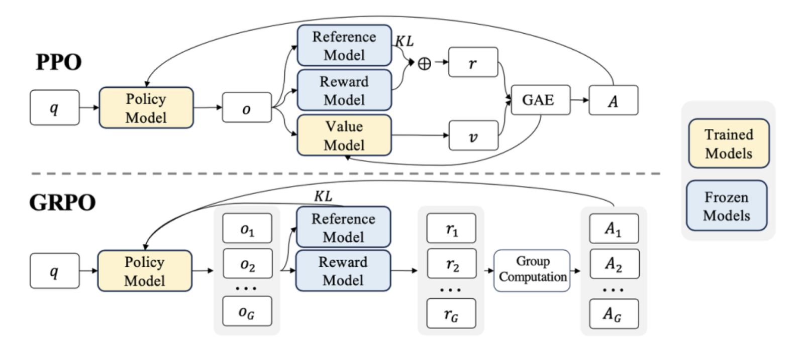

# RLHF_learn

TRPO：用优化问题的约束限制新策略更新步幅，使策略梯度方法训练更加稳定

PPO：用clip函数限制新策略更新步幅，使策略梯度方法能够在工程上落地使用

DPO：核心思想是跳过奖励模型训练，直接利用人类偏好对 来优化策略模型。

GRPO（deepseek）：用组内平均回报值替代Crictic网络，极大降低大模型强化学习训练开销

DAPO（字节）：提高clip上界、动态采样、token级梯度聚合、引入规则奖励、移除KL，优化了GRPO中的多个缺陷

GSPO（qwen）：序列级重要性采样对齐序列级reward，解决token级噪声和MoE的routing replay问题

## TRPO算法与PPO算法

PPO和TRPO算法最大的不同就是在**如何控制策略更新的幅度**

**TRPO** 通过 **KL散度约束** 来控制策略更新的幅度。

优化目标为：$max_{\theta} \ \mathbb{E}\Big[ \frac{\pi_\theta(a|s)}{\pi_{\text{old}}(a|s)} A(s,a) \Big]$

在此基础上加一个 **KL 散度约束**：$\mathbb{E}\big[ KL(\pi_{\text{old}} \,\|\, \pi_\theta)\big] \le \delta$

**如果用惩罚因子替代约束条件，TRPO优化问题可以表述为：**

$$
\max_{\theta}\; \hat{\mathbb{E}}_t\Bigg[
\frac{\pi_\theta(a_t\mid s_t)}{\pi_{\theta_{\text{old}}}(a_t\mid s_t)}\hat{A}_t
-\beta\,\mathrm{KL}\!\left(\pi_{\theta_{\text{old}}}(\cdot\mid s_t)\,\|\,\pi_\theta(\cdot\mid s_t)\right)
\Bigg]
$$

---

**PPO** 则通过 **裁剪目标函数**（clipping）来实现对策略更新的控制。

优化目标为：

$$
L(\theta) = \mathbb{E}_t\big[ \min \big( r_t(\theta) \hat{A}_t,\ \text{clip}(r_t(\theta), 1-\epsilon, 1+\epsilon)\hat{A}_t \big) \big]
$$

| 维度 | TRPO | PPO |
| --- | --- | --- |
| 控制更新方式 | 显式 KL 约束 | 裁剪比值的目标函数 |
| 优化问题 | 约束优化（需要近似二阶信息、共轭梯度等） | 标准一阶梯度优化（用 Adam 等就行） |
| 实现复杂度 | 高：代码复杂、调试困难 | 低：实现简单、工业界和开源里用得更多 |
| 理论角度 | 更接近严格的 trust region 理论 | 近似方法，理论上略弱但足够好用 |

## **从PPO到DPO算法**

Direct Preference Optimization。DPO 由斯坦福大学的研究者于 2023 年提出，它以一种惊人的简洁性，对传统的 RLHF 流程发起了挑战。DPO 的核心洞见是：**我们完全可以绕过奖励模型建模这一中间步骤，直接利用人类的偏好数据来优化语言模型**。

- **PPO-RLHF**：
    1. 偏好数据 → 训练奖励模型
    2. 模型采样 → 奖励模型打分 → PPO 更新策略（+KL）
- **DPO**：
    - 直接：偏好数据 → DPO 损失 → 更新策略（隐式包含 KL 约束）

我们的目标就是不再利用显示奖励，而是利用隐式奖励-最大化偏好概率，偏好概率变成了：

$$
P(y_w \succ y_l \mid x)
= \sigma\Big(\beta \big[(\log \pi_\theta(y_w|x)-\log \pi_{\text{ref}}(y_w|x)) - (\log \pi_\theta(y_l|x)-\log \pi_{\text{ref}}(y_l|x))\big]\Big)
$$

所以**“隐式奖励” =“当前模型 vs 参考模型 的 log 概率差”**

损失函数定义

$$
\mathcal{L}_{\text{DPO}}(\pi_\theta; \pi_{\text{ref}})
= - \mathbb{E}_{(x, y_w, y_l) \sim \mathcal{D}}
\left[
  \log \sigma\left(
    \beta \log \frac{\pi_\theta(y_w \mid x)}{\pi_{\text{ref}}(y_w \mid x)}
    - \beta \log \frac{\pi_\theta(y_l \mid x)}{\pi_{\text{ref}}(y_l \mid x)}
  \right)
\right].
$$

**DPO 的训练流程**

**(1) 数据准备**

- 收集大量**偏好数据**：每条是一个三元组 $(x, y_w, y_l)$ = (指令, 胜出回答, 失败回答)。

**(2) 初始化模型**

- 有一个已经做完 SFT 的模型：$\pi_{\text{SFT}}$。复制两份：一份当作**当前训练模型** $\pi_\theta$，参数会更新；另一份当作**参考模型** $\pi_{\text{ref}}$，参数冻结不动。

> 参考模型的作用类似 PPO 里的 KL 惩罚项：约束当前模型不要跑得离初始太远。从PPO到DPO
> 

**(3) 训练循环**

对每个 batch 的偏好数据：

1. **前向计算**
    - 对 batch 里的每条 $(x, y_w, y_l)$：用  $\pi_\theta$ 和 $\pi_{\text{ref}}$分别计算四个值，然后计隐式奖励差 $\Delta$

代入 DPO 损失。

1. 反向传播，更新参数

DPO的训练与PPO的奖励模型的训练过程区别：

PPO 的奖励模型训练时直接优化奖励模型中以Transformer 为骨干的参数；DPO的训练直接优化策略模型的参数。

## **GRPO（***Group Relative Policy Optimization***）算法**

**1.在 RLHF 中，价值网络-Value Model（就是上面的Initial Language Model）起什么作用？**

**估计当前状态的期望回报** $V_\phi(x)$，作为 baseline；**辅助计算优势函数（Advantage）**，即：`A=r−Vϕ(x)`

> 在 PPO 中，价值模型（Value Model）通常与策略模型（Policy Model）同规模、同架构，只是输出头不同。
> 
> 
> 对于像 GPT-3/4 这样的大模型，这意味着要**再维护一份几乎等大的网络参数**（几十亿量级），训练和显存消耗都非常大。
> 

2.从 PPO 到 GRPO 的过渡思路

### GRPO 的做法（上图下部分）

以组内平均奖励作为baseline

- 每个 prompt q 生成多个候选输出 $o_1, o_2, ..., o_G$
- 奖励模型分别给出得分 $r_1, r_2, ..., r_G$
- 通过组内相对比较（Group Computation）得到优势 $A_i$，而不依赖显式价值估计。

即： $A_i = r_i - \text{mean}(r_1, ..., r_G)$

或更复杂的归一化形式。

> 因为优势函数是通过同一组样本内部比较得到的，不需要单独训练 Value Model。
> 

### GRPO局限性

重要性采样的本质是：我们希望在新的分布下计算期望，但数据却来自旧分布。在 PPO/GRPO 中，我们不会直接用新策略采样，而是先用旧策略生成数据（因为采样代价高），这一过程称为 **Rollout**。在更新参数时，我们需要修正两者的分布差异，这就是重要性采样的作用。定义每个 token 的重要性比为：$r_t=\frac{\pi_\theta(a_t|s_t)}{\pi_\theta(old)(a_t|s_t)}$，则 PPO/GRPO 的目标函数可写为：
$L^{clip}(\theta) = \mathbb{E}_t \left[
\min(r_t A_t,\ \text{clip}(r_t, 1-\epsilon, 1+\epsilon) A_t)
\right]$

## 从GRPO到DAPO算法

DAPO 在 **clip 机制、采样策略、梯度聚合、奖励设计** 四个层面优化了GRPO

1. **Clip-Higher：提高 clip 上界**
    - 解决“好 token 涨幅受限”的问题；让高质量 token 获得更充分的正向更新。
2. **动态采样（Dynamic Sampling）**
    - 解决“reward 全 0 或全 1 导致无梯度”的问题；保证每个 query 都尽量产出有效梯度，提升样本效率和训练稳定性。
3. **Token-Level Gradient Loss：token 级聚合**
    - 解决“回答越长每个 token 越不重要”的问题；公平对待长短回答的 token，使高质量长回答的信号不会被稀释。
4. **Overlong Reward Shaping：规则奖励 / 软惩罚**
    - 控制回答长度，惩罚过长回答；在保证内容质量的同时，鼓励简洁、符合需求的输出。

### 1. Clip-Higher：提高 clip 上界（**非对称裁剪策略**）

GRPO 中 clip 区间是对称的 $[1-\varepsilon, 1+\varepsilon]$。当 old policy 对某个 token 的概率很低，而该 token 的 advantage 又是正值（即 old model 恰好采样得非常好），此时当前 policy model 的上涨空间就会受到很大限制。

**DAPO做法：拉高上界 $\operatorname{clip}(r_{t}, 1-\varepsilon_{\text{low}}, 1+\varepsilon_{\text{high}})$**

---

### 2. 动态采样（Dynamic Sampling）

固定次数采样时，经常采不到有效梯度，设想对一个 query 固定采样 G=10 次：如果 10 次回答都很好（都拿到 max reward），在做**归一化 advantage**时，这 10 个样本的 advantage 会全变成 0。

**DAPO做法**做法：按 reward 分布“抽到为止”，如果当前采样结果 reward 全 0 或全 1，就继续采样。

---

### 3. Token-Level Gradient Loss：token 级梯度聚合

GRPO 中回答越长，每个 token 的梯度越被稀释，GRPO 的损失在回答级别聚合方式是：
先对每个 sample 的所有 token 求平均；再对 所有sample 求平均 $\frac1G \sum_{i=1}^G \frac1{|o_i|} \sum_{t=1}^{|o_i|} L_{i,t}$

这意味着比如：第一个样本长度 200 token；第二个样本长度 10 token。在GRPO下

- 第一个回答每个 token 的权重： $(1/200) \times (1/G)$
- 第二个回答每个 token 的权重： $(1/10) \times (1/G)$

**DAPO**做法：整个 batch 里的所有 token 统一做平均；$\frac1{\sum_{i=1}^G |o_i|} \sum_{i=1}^G \sum_{t=1}^{|o_i|} L_{i,t}$

在**DAPO**下

- 总 token 数 = 210；每个 token 权重都是  $(1/210) \times (1/G)$

---

### 4. Overlong Reward Shaping：对过长回答的软惩罚 / 规则奖励

防止模型无限“灌水”、占用长度预算。

**DAPO**加入了 **长度相关的 soft punishment**（规则奖励的一种）：当回答长度超过第一个阈值 $L_1$ 后，reward 开始随长度线性减小；超过第二个阈值 $L_2$ 后，惩罚强度已经等同于把该回答获得的正奖励全部抵消。

## **GSPO（Group Sequence Policy Optimization）：解决 MoE 训练中 GRPO 不稳定的问题**

如果说 **DAPO** 是在 GRPO 框架内做“微调与优化”，那么 **GSPO** 则是直接调整了优化目标的颗粒度——从 GRPO的*token-level* 跳到 GSPO的*sequence-level*。这一变化的动机，主要源于在 MoE 架构训练时，GRPO 的重要性采样会引入巨大方差和不稳定性。GSPO 的核心思想是：优化奖励时不再依赖逐个 token 的比值，而是关注整个生成序列的表现，从而降低噪声并提升稳定性。

**GRPO 和DAPO的局限性**

但在 **MoE 结构** 下，即使用了 DAPO，依然会出现：**训练非常不稳定、方差巨大甚至发散**；根本原因主要有两个：

**(1) importance ratio 的粒度与 reward 不匹配**

我们的奖励其实是对每个回答整体给出的评价，但是在 per-token 的操作中，我们又把这个奖励平摊到每个 token 上（reward shaping），然后试图在 token 层面逐个做调整，所以这里就发生了一个优化的目标和奖励目标的颗粒度的差异。

即**目标是 sequence-level 的，校正因子却是 token-level 的**，二者粒度不一致。

**(2) MoE 的路由（router）本身就很“结构不稳定”**

MoE 里面，router 会把每个 token 分配给不同 expert，这个决策本身就是 policy 的一部分，而且常常很“跳”，一次训练就可能把不同 token 派给不同 expert。

即**新旧策略可能激活不同的专家，带来结构性偏差，引起噪声**。

**解决MOE问题，在GSPO 之前的做法：Routing Replay**

- 推断时把旧策略的路由路径记录下来；训练时强制新策略走相同的路由路径，再用 GRPO/DAPO 优化。（工程很复杂，无法享受 MoE“路由自由探索”的优势）

---

### GSPO 的核心设计：sequence-level importance ratio

**定义 sequence-level 的 importance ratio：**

先看定义：

$$
s_i(\theta)
= \Bigg(
\frac{\pi_\theta(o_i|q)}{\pi_{\text{old}}(o_i|q)}
\Bigg)^{\frac1{|o_i|}}
= \exp\!\left(
\frac1{|o_i|}\sum_{t=1}^{|o_i|}
\log\frac{\pi_\theta(a_{i,t}|q,o_{i,<t})}
{\pi_{\text{old}}(a_{i,t}|q,o_{i,<t})}
\right)
$$

几点关键信息：$\frac{\pi_\theta(o_i|q)}{\pi_{\text{old}}(o_i|q)}$是**整条回答的概率比；**

- GRPO：$\min(r_{i,t}A_i,\operatorname{clip}(r_{i,t})A_i)$ —— **每个 token 一个 ratio**；
- GSPO：$\min(s_i A_i,\operatorname{clip}(s_i)A_i)$—— **每条回答一个 ratio**。

GRPO 是**每个 token 一个 ratio**，但奖励 $A_i$是“整条回答”的序列级，粒度不匹配，长序列上 ratio 容易抖、方差大。GSPO 把它改成**sequence-level ratio**：先把整条回答新旧策略概率的比值做几何平均得到 $s_i$。

## ARPO

[https://blog.csdn.net/weixin_44778145/article/details/153779112](https://blog.csdn.net/weixin_44778145/article/details/153779112)

人民大学与快手公司的这篇论文提出了一种名为「智能体增强策略优化」（Agentic Reinforced Policy Optimization, ARPO）的**基于熵的自适应强化学习算法**，专门用于训练需要与外部工具进行多轮交互的 LLM 智能体。

**ARPO 通过“熵感知 + 优势归因”机制，在多轮工具调用任务中实现了更精细、更高效的探索，显著优于传统轨迹级 RL 方法，是 Agentic RL 领域的重要进展。**

## AEPO

AEPO（Agentic Entropy-Balanced Policy Optimization）提出在两个阶段**平衡熵**：

**AEPO 是第一个在 Rollout 和 Policy Update 双阶段中系统平衡熵的 Agentic RL 方法，显著提升了大模型在多轮工具调用任务中的探索能力与训练稳定性。**

### 1.研究背景

**Agentic Reinforcement Learning（Agentic RL）** 通过让模型与外部工具（如搜索引擎、代码解释器）交互，提升其推理与信息获取能力。

**Web Agent + Agentic RL 的大背景：**大模型本身是“静态知识库”，容易**幻觉**、**知识过期**，所以大家搞了 RAG，用检索来补充知识。但传统 RAG 大多是“一次性检索”，难以支持真正 **多轮、长链条的 Web 探索**。于是各种 Web Agent 出现，让 LLM 可以像人一样：反复搜索 → 打开网页 → 写代码 → 再搜索。

### **2.现有 Entropy-driven Agentic RL 的问题**

主流 agentic RL（如 ARPO 等）有一个核心套路：

> 在 高熵（高不确定性） 的 tool-call 步骤上多打分支，扩展出更多候选轨迹。
> 

**问题 1：High-Entropy Rollout Collapse（高熵 rollout 崩塌）**
这些高熵点不停地「疯狂打分支」，结果：分支预算被一小撮路径耗光，整体探索多样性下降。

**问题 2：High-Entropy Token Gradient Clipping（高熵 token 梯度被剪没了）**

在 policy update 里（比如 GRPO、ARPO 这种），会用 **重要性采样比值 + clip** 来稳住训练。逻辑衔接词、反思 token、以及 **tool-call 相关 token**，往往都是**高熵 token**；然而这些 token 的梯度在一开始就被 **严重 clipping**，甚至第一步更新就被“剪到死”。

### **3.**AEPO 的核心思想：在 Rollout 和 Policy Update 两个阶段“平衡熵”

AEPO 全名 **Agentic Entropy-Balanced Policy Optimization**，核心目标一句话：

> 在“采样 Rollout”和“策略更新”两个阶段同时做熵平衡：
既利用高熵指导探索，又避免过度依赖高熵导致“过分 branching”和“梯度被剪没”。
> 

**3.1 动态熵平衡 Rollout机制**

在正式采样前，先运行一次完整轨迹

- 多少 budget 用来做 **全局采样（global sampling）**，
- 多少用在 **高熵步骤的分支采样（branch sampling）**。

直觉是：

- 如果 **问题本身更不确定（H_root > H_tool_avg）**：
    
    → 应该多做 **global sampling**，看看不同整体思路；
    
- 如果 **工具调用带来的不确定性反而更大（H_root < H_tool_avg）**：
    
    → 应该多把预算分配给 **branch sampling**，专门在高熵工具步骤上细致探索。
    

这样一来，**全局 vs 分支的采样资源不再是拍脑袋，而是由“熵差”动态决定**。

3.2 **熵平衡策略优化（Entropy-Balanced Policy Optimization）**

**停止梯度裁剪（Stop-Gradient Clipping）**

- 在传统 PPO/GRPO 中，高熵 token 的梯度常被裁剪。
- AEPO 引入 **stop-gradient** 操作，使得：
    - 前向传播仍使用裁剪值（保证稳定性）
    - 反向传播保留高熵 token 的梯度（保证学习）
