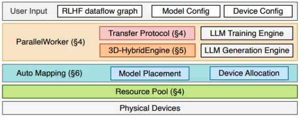

# RLHF训练框架总结

1️⃣ LLaMA-Factory
LLAMA Factory 是一个基于 Hugging Face Transformers 的开源项目，专注于为大型语言模型提供高效、灵活且用户友好的微调框架，是一个封装比较完善的LLM微调工具，它能够帮助用户快速地训练和微调大多数LLM模型。（有前端UI，傻瓜操作）

2️⃣ Megatron
Megatron 是由 NVIDIA 开发的一个强大的开源工具集，专门用于大规模训练巨型Transformer模型。它提供了两个主要组件：Megatron-LM 参考实现为训练最先进的基础模型提供了开箱即用的解决方案；而Megatron Core 可组合库则为开发者提供了高度优化的基础模块，用以构建自定义的、高性能的训练框架。英伟达 Megatron 支持模型并行化技术（Deepspeed及FSDP本质都是数据并行），追求极致吞吐。但是，Megatron 与人们常用的 Hugging Face 软件库不兼容。

3️⃣ ms-swift
ms-swift 是 ModelScope 社区官方推出的轻量级可扩展微调框架。它支持超过 450 个纯文本大型模型和 150 多个多模态大型模型，覆盖了从模型训练到部署的整个流程。该框架支持包括 LoRA、QLoRA 在内的多种轻量级微调方法，以及分布式训练、量化训练和强化学习人类反馈训练。

4️⃣ unsloth
unsloth 旨在显著加快大型语言模型的微调速度并降低内存使用。它支持包括 Llama、DeepSeek、Gemma 和 Mistral 等多种模型。unsloth 利用高度优化的 OpenAI Triton 内核和手动反向传播引擎来实现性能提升。它支持全参数微调、预训练以及 4 位、8 位和 16 位的高效训练，并声称在加速和减少内存使用的同时不会损失精度。

5️⃣ trl
TRL（Transformers Reinforcement Learning） 是 Hugging Face 推出的一个专门用于大语言模型对齐和微调的库。它建立在 Transformers 和 Accelerate 之上，兼容 Hugging Face 生态（Datasets、PEFT 等），并提供了简单易用的接口来实现.

6️⃣ verl
Verl 是一个灵活、高效且可用于生产环境的强化学习训练库，由字节seed团队开发，专为大语言模型设计；基于HybridFlow的架构，基于FSDP, Megatron-LM, vLLM, SGLang等构建的框架。

7️⃣ OpenRLHF
OpenRLHF 是一个基于 Ray、DeepSpeed 和 HF Transformers 构建的高性能 RLHF 框架。OpenRLHF 是目前可用的最简单的高性能 RLHF 库之一，无缝兼容 Huggingface 模型和数据集。 RLHF 训练中 80% 的时间用于样本生成阶段。

## TRL

TRL依靠零冗余优化器（Zero Redundancy Optimizer/ZeRO），来将 RLHF 训练涉及的四个模型配置到同一台 GPU上。这个过程被称为 co-location，即空间并置。在内存有限的 GPU 上，这种调度方法的效率会越来越低。

为了解决空间并置的限制，TRL 等一些框架选择在内存使用上做出妥协，其做法包括将 actor 和 critic 模型融合起来或采用低秩适应（LoRA）等技术。但是，这些技术会降低模型性能，而且融合 actor-critic 式架构与备受推崇的实践做法不兼容，即使用奖励模型的权重来初始化 critic 模型的权重。

## OpenRLHF

> OpenRLHF 的核心原理，就是把 RLHF 这条“生成 → 打分 → 训练”的流水线拆成多个「角色模型 + 阶段」，然后用 Ray 做调度、vLLM 负责高吞吐生成、DeepSpeed 负责高效训练，让超过 70B 的大模型也能稳定跑 RLHF / RLVR。
> 

### 1. 它到底要解决什么？

经典 RLHF（PPO）要同时维护四个模型：很多开源框架（TRL / ColossalChat / DeepSpeed-Chat）是把这四个模型都 **塞到同一批 GPU 上（co-location）**，再用 ZeRO 去切优化器/梯度/权重。

问题是：

- 模型一旦 >70B，四个模型挤在一起 **显存爆炸**
- 即便塞得下，也要把 DP/TP/ZeRO 都开得很激进，**通信和调度非常低效**
- 想加多个 reward model、换算法，都会让这套“硬塞”方案非常痛苦

**OpenRLHF 的出发点**：

> 不再强迫四个模型挤在同一台 GPU 上，而是让不同模型、不同阶段分散到集群中各处，由一个统一调度层（Ray）来编排数据流和计算流。
> 

---

### 2. 核心原理一：Ray 做“总调度”，4 个模型分布式安放

OpenRLHF 把 RLHF 训练拆成若干“角色 + 阶段”，比如：

- 角色：actor / critic / reward / reference / rollout engine
- 阶段：样本生成（rollout）→ 打分与优势估计 → 策略更新

每种角色可以在一组 GPU 上独立运行：

- 一部分 GPU 专门跑 **actor 训练**
- 另一部分 GPU 专门跑 **critic + reward**
- 还有一批 GPU 专门跑 **vLLM rollout（生成）**

它用 **Ray** 来做这一层编排：

- 在 Ray 上，每个“角色”是一个 **worker group**（里面还是正常的 torch distributed + NCCL）
- Ray Driver 负责：
    - 把 prompt 分发给 rollout 集群
    - 收集生成的轨迹（response、logprob 等），丢给 critic / reward 集群
    - 收集优势 & 训练样本，再调度到 actor/critic 训练集群

**关键点**：

- 各个角色 **内部** 还是你熟悉的 SPMD（DP / TP / ZeRO-3 等），不改 PyTorch/FSDP 的那套范式
- 角色 **之间** 的通信、负载均衡、故障恢复，由 Ray 负责
- 这样就从“**一套并行配置绑死四个模型**”，变成“**每个模型自己调自己最合适的并行策略**”([arXiv](https://arxiv.org/pdf/2405.11143?utm_source=chatgpt.com))

这就是它可扩展性的第一大核心：**拆角色 + Ray 调度**。

---

### 3. 核心原理二：vLLM 接管生成（rollout），解决推理瓶颈

在 RLHF 里，最贵的一步往往不是反向传播，而是：用 actor 生成大量 trajectory（rollout）

- 样本生成不用 `transformers.generate`，改用 vLLM 这种高吞吐推理引擎。
- 训练用的 Actor 和 vLLM 里的 Actor 权重定期同步：
    
    训练专心 backward，vLLM 专心高效解码。
    
- 这样 RLHF 中最贵的“生成大量回答”那一步不再卡死。

---

### 4. 核心原理三：DeepSpeed / ZeRO-3 + 各种小优化撑起大模型训练

- Actor / Critic / Reward 等都用 ZeRO-3 / 3D 并行来切参数、梯度和优化器状态，撑到 70B+。
- 配合去 padding、token 级 batch、FlashAttention 等手段，把显存和算力尽量用在有效 token 上。
- 内置 PPO / DPO / RLVR 等常见对齐算法和稳定训练的技巧（KL 惩罚、奖励归一化、混合 LM loss 等）。

## Verl

[https://zhuanlan.zhihu.com/p/30876678559](https://zhuanlan.zhihu.com/p/30876678559)

[https://www.cnblogs.com/sunstrikes/p/18274445](https://www.cnblogs.com/sunstrikes/p/18274445)

全称**Volcano Engine Reinforcement Learning for LLMs，**由字节seed团队开发，包含功能如下：
训练支持：FSDP、FSDP2、Megatron-LM
推理加速：vLLM、SGLang 、HF Transformers
兼容Hugging Face生态：支持Qwen-3、Qwen-2.5、Llama3.1、Gemma2、DeepSeek-LLM等主流模型
监督微调（SFT）
强化学习算法：支持PPO、GRPO、ReMax、REINFORCE++、RLOO、PRIME、DAPO、DrGRPO等
对齐技术：如自博弈偏好优化（SPPO）
优化技术：Flash Attention 2、序列打包、DeepSpeed Ulysses序列并行、LoRA、Liger内核加速
扩展能力：支持70B级模型与数百GPU集群
实验管理：集成wandb、swanlab、mlflow、tensorboard

**Verl 的核心原理就是——把 RLHF 这一整条「生成 → 打分 → 训练」流水线拆成多个角色和阶段，然后用最合适的并行方式和推理引擎，把每一段都压榨到极致。**

### 1. Verl 要解决的是什么问题？

经典 RLHF（PPO）工作流可以概括成 3 个 Stage：

**Stage 1（rollout）：**用actor生成 response；**Stage 2（数据准备）**：用 critic / ref / reward 做各种前向，算 advantage、logprob 等训练数据；**Stage 3（训练）：**对 actor / critic 反向传播、更新参数。

如果直接在「一个 PyTorch 训练脚本」里，把这四个模型都 init 一遍，然后用 `deepspeed.initialize()` 简单包一下就开干——小模型还能跑，大模型立刻遇到：

- 显存不够：需要 Zero-3 / FSDP FULL_SHARD 级别的切分
- 一用 Zero-3 就发现：**generate 极慢**（每个 token 都要 all-gather 参数）
- 四个模型都「塞进同一套并行」里，**并行超参被迫一致**，通信开销也被放大

Verl 的设计就是：

> 「用更聪明的并行方式 + 独立的推理引擎 + 合理的模型/设备拆分，把 RLHF 这条链路做成高吞吐的工厂流水线。」
> 

---

### 2. 底层基石：并行 & SPMD 思路

**标准训练流程**包含三个核心环节1.模型forward，计算loss，保存中间激活值；2.模型backward，通过中间激活值计算gradient；3.模型update，把gradient传给optimizer，更新模型weight。

**deepspeed使用的zero stage**:

1. zero1中，每张卡只需要保留1/n的optimizer参数，通信量保持不变
2. zero2在zero1的基础上，每张卡只需要保留1/n的graident，通信量保持不变
3. zero3在zero2的基础上，每张卡只需要保留1/n的model weight，通信量变为1.5倍。

Zero3为什么通信多？Zero3模式下的训练流程演进为：

1.**Forward阶段**：all-gather获取完整参数→计算loss→释放参数→保存中间激活

2.**Backward阶段**：all-gather获取完整参数→计算梯度→释放参数

3.**Update阶段**：ReduceScatter所有卡的G, 从其他卡上取到需要需要更新的梯度增量, 然后释放不是自己维护的G.使用自己维护的OS和G来更新W, 不需要通信.

重点理念有几个：

1. **Data Parallel（DP）**
    - 各 rank 拿不同数据，模型权重相同。
    - 只在 backward 后做梯度 all-reduce（gradient accumulation）。
    - Zero stage（或 FSDP FULL_SHARD）只是在优化器 / 梯度 / 权重上做进一步切分，并不改变「计算时是完整模型参数」这一点。
2. **Tensor Parallel（TP）**
    - 把线性层的权重按列或按行切开，每个 rank 只算自己那块，然后通过 all-gather / reduce-scatter 拼回结果。
    - 中间激活值在 TP 下是被切分的（和 Zero-3 只切参数不切激活不一样）。
3. **Pipeline Parallel（PP）**
    - 不同 rank 放模型的不同层，前向时一段一段往下传，存在 pipeline bubble。
    - 推理阶段通常更偏向纯 TP，PP 会带来等待和显存碎片问题。
- 对于dp，通信的是**模型参数**，也就是W和它对应的weight/optimizer
- 对于tp/pp，通信的是**中间激活值**，例如PP需要将上一个rank计算得到的中间结果传给下一个rank继续计算。
1. **SPMD（Single Program Multiple Data） 编程范式**

引入：难道我要给每张 GPU 写一份不一样的代码？如果用“一个进程控制所有 GPU”（系统根本维护不动。于是SPMD做法如下：

- 所有进程跑一份完全相同的代码，仅靠 env 里的 `RANK / WORLD_SIZE` 决定自己是谁。
- 不存在「中控进程」，通信靠 collective（all-reduce / all-gather / broadcast 等）。
- 好处是高效；坏处是**写起来很痛苦**：一不小心就 rank 不对齐 / random state 不一致 / deadlock。

Verl 里，**每个「角色模型」（actor/critic/ref/reward）内部都是标准 SPMD 思路**：Verl 自己只是在「角色之间」做编排和数据流控制，不去发明新的并行范式。

---

### 3. Stage 1：用 vLLM 做 rollout——训练模型和推理引擎分家

瓶颈最严重的就是 **Stage 1 的生成（actor.generate）**：

Zero-3 下，每生成一个 token 都要 all-gather 完整参数 → 通信量接近「模型大小 × 输出长度」。实际测下来：即使 zero2 能跑，**生成这一步也常常占 50%–80% 的时间**。

Verl 的核心改动：

> 用专门的推理引擎（vLLM / SGLang）来接管 rollout，而不是直接用 HF Transformers 的 generate。
> 

**3.1 推理引擎能带来什么？**

vLLM 一类引擎内置了：专门优化的算子（如 PagedAttention）；高效 KV Cache 管理（预分配、重用）；更聪明的 batch / request 调度。

但这又带来两个问题：

1. vLLM 早期基于 **Ray driver** 调度，不是 SPMD
2. vLLM 默认是「从 HF 权重文件初始化」，而 Verl 希望从**内存中的 actor 模型**同步权重

**3.2 Verl 的做法：魔改 vLLM，做成 SPMD + 可从 actor 注入权重**

总结一句：FSDP + vLLM 方案的「原理」就是——训练模型用了零碎的 shard（Zero-3），rollout 模型用了 TP 的整块参数，但通过一个 sharding manager 把两者在权重空间对齐，并且在显存上做到按需加载和按需释放。（推理端与训练端的对齐）

---

### 4. Stage 2 & 3：按 token 视角重构计算，减少显存/算力浪费

Stage 2/3 其实都是「只 forward / forward + backward」的问题，但 Verl 做了很多 infra 级别优化：

**4.1 Remove padding：从「按 batch」变成「按 token」看世界**

思路：输入通常是 `[bs, seq_len]` 的 `input_ids` + `attention_mask`，里面大量 PAD token。

比如一个 batch 里，有的回复 20 个 token，有的 200 个 token。为了凑成矩阵，要把短的右边补 PAD：变成统一长度，比如全都 200。

verl把所有非 PAD 的 token 抽出来，接成一条长队，只给这些“真 token”算。

> 结果：中间激活完全变成「按真实 token 数」计算，长短样本不再为对方背锅。
> 

在 Verl 里，Stage 2/3 的许多模块（logprob/value/reward 计算）都包了一层这种「去 padding 的模型」。

**4.2 避免巨大 logits 占用显存：分片算 log-softmax**

 **logits理解：**

语言模型每次预测下一个 token 时，会输出一个向量：`logits = [s_0, s_1, s_2, ..., s_{V-1}]`（这里 V 是vocab_size大小（比如 50k、100k）。些 `s_i` 本身不是概率，只是“对每个词的偏好分数”）

eg：2句话，每句话3个token，此表大小为5（[batch_size, seq_len, vocab_size] = [2, 3, 5]）

可以展开理解成 6 个位置（2×3），每个位置都有 5 维 logits：

- 第 1 句，第 1 个 token 的 logits：`[... 5 维 ...]`
- 第 1 句，第 2 个 token 的 logits：`[... 5 维 ...]`
- …
- 第 2 句，第 3 个 token 的 logits：`[... 5 维 ...]`

传统算 loss 的流程：

对整个 logits 做 `log_softmax`，得到同样形状的 log 概率：我们真正想要的是每个位置 `log_probs[位置][正确 id]`，然后做 cross-entropy。（其余 4 个都白算，白占显存）

Verl做法：算/只留“正确那个位置”的 logprob

---

### 5. Colocate vs Split：为什么要引入 Ray？

前面说的都还是「**所有角色模型都跑在同一批卡上**」的 colocate 思路：

- 每张 GPU 上都有 actor / critic / ref / reward 的一份（或一段）。
- 好处：一直在忙，很少有资源空转。
- 坏处：每张卡要塞四个模型 → 并行度不得不开得很高 → **通信非常重；**四个模型被迫共用一套并行超参，很多场景不灵活（例如小 actor + 大 critic）。

另一条路是 **split placement**：比如：64 卡只跑 actor；32 卡只跑 critic；16 卡只跑 ref；16 卡只跑 reward

- 优点：每个模型可以单独调自己的 DP/TP/PP；通信只发生在本角色内部的 SPMD 计算里
- 新问题：**角色之间的数据流**（stage1 到 stage2、stage2 到 stage3）不好用纯 SPMD 表达；单靠 `torchrun + NCCL` 搞，会写出一堆 rank 对齐、广播、gather 的脆弱代码。

**5.1 Verl 的解法：用 Ray 做「有形的大手」**

Verl 的拆分方式：

- **各角色内部**：继续用 SPMD（FSDP 或 Megatron）。
- **角色之间**：用 Ray 的 driver + worker 模型。

思路类似：

- **Ray driver**：负责「数据流编排」
    - 什么时候向 actor 集群发 prompts
    - 什么时候把 rollout 返回的数据转给 critic/ref/reward
    - 什么时候触发下一轮训练
- **Ray worker**：负责「计算流」
    - 内部就是一个自成一体的 torch distributed 程序
    - 照常 init process group、FSDP/Megatron、反向传播、优化器 step

为此 Verl 抽象了 **WorkerGroup**：

- 每个角色（Actor/Critic/Ref/Reward/Rollout）对应一个 WorkerGroup
- WorkerGroup 里是一组 Ray worker + 一组 GPU
- WorkerGroup 内部仍是「多进程 SPMD + NCCL 集合通信」
- WorkerGroup 之间的数据交换走 Ray 的 object store / RPC

> 这样，算法同学魔改「RL 算法逻辑」时只需要碰 Ray driver 这一层；
> 
> 
> 想优化分布式效率，就只动 Worker 的 SPMD 部分，两边解耦。
> 

---

### 6. 总结：一句话版本的「Verl 原理」

合在一起看，Verl 的「原理」可以总结成几个关键词：

1. **流水线拆分**：明确把 RLHF 划成 rollout / 数据准备 / 训练三阶段，每个阶段用最合适的工具。
2. **训练 vs 推理分家**：训练用 FSDP 或 Megatron，rollout 用 vLLM/SGLang （SG浪）这类专用推理引擎，通过 sharding manager 对齐参数。
3. **混合并行 & 显存精打细算**：
    - FSDP Zero-3 / 3D 并行
    - 去 padding、token 级 micro-batch
    - 动态批大小、logits 低显存计算
    - 模型 & KV cache 按需装载 / 释放
4. **角色拆分 + Ray 编排**：内部继续坚持 SPMD，外部再加一层「有形的大手」驱动数据流，让 actor/critic/ref/reward 可以分集群、高效协作。
